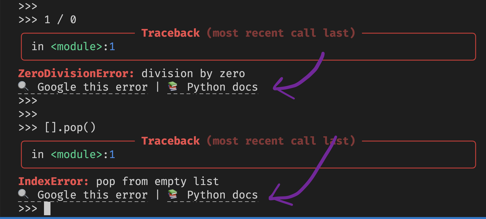

# `error-links`

`error-links` adds Google and Python documentation links to the bottom of exceptions.

In most terminals, you will need to hold <kbd>Cmd</kbd> or <kbd>Ctrl</kbd> to allow _clicking_ the link.

This works really well alongside [Rich's traceback handler](https://rich.readthedocs.io/en/stable/traceback.html#traceback-handler), which is what enabled the highlighting and coloured output in the screenshot above.
